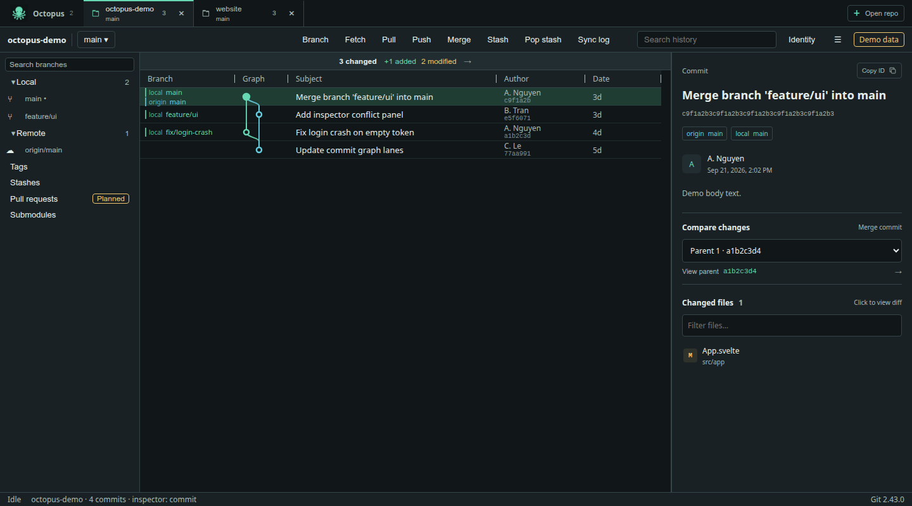
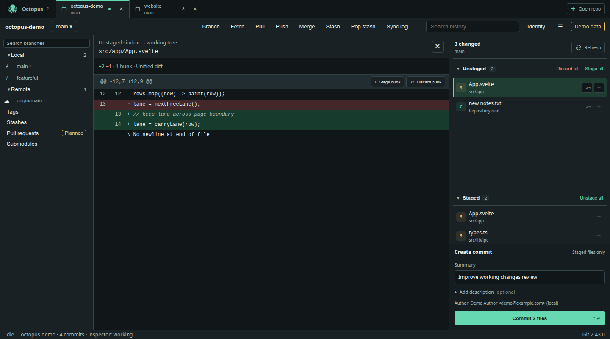
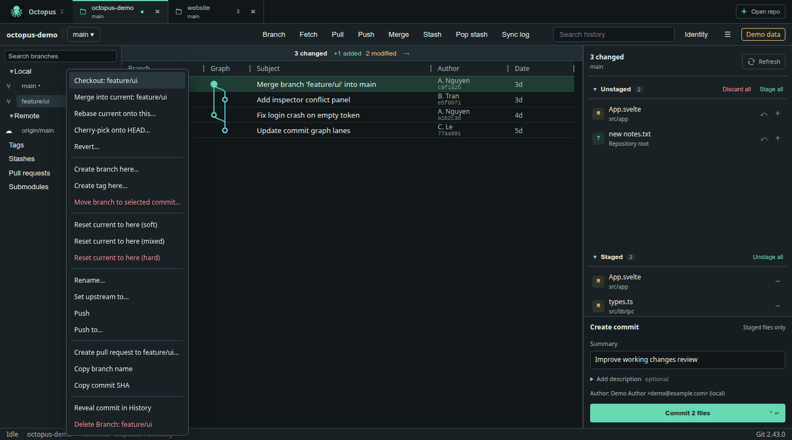
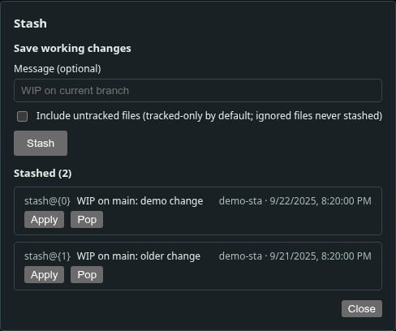
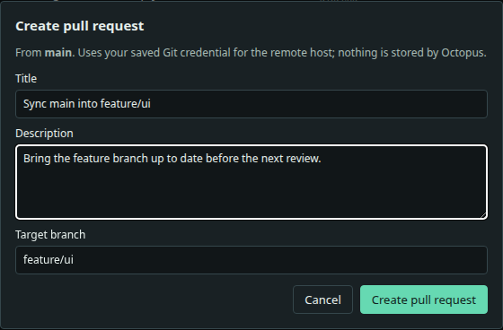

# Octopus

A Git desktop client built with **Rust, Tauri 2, Svelte 5, and TypeScript**, with Linux as the primary platform. Browse history, review changes, create commits, and work across multiple repositories in one window.

[Releases](https://github.com/lenovo1996/Octopus/releases) · [Run from source](#run-from-source) · [Build and test](#build-and-test)

## Features

The screenshots below show the current interface with built-in browser demo data.

### Multiple repositories and commit history

Open repositories in separate tabs, keep a draft for each workspace, and search commit history. The graph shows branches and merge relationships; selecting a commit opens its metadata, changed files, and parent comparison.



### Review, stage, and commit changes

Inspect staged and unstaged files in a unified diff with syntax highlighting. Stage individual files or supported text hunks, review additions and deletions, then write a commit summary and optional description. Discard actions ask for confirmation.



### Branch and history actions

Search local and remote branches, create branches and tags, and manage upstreams. Context menus provide checkout, merge, rebase, cherry-pick, and revert actions. Fetch, pull, and push are available in the toolbar; the merge workflow also includes conflict inspection and resolution.



### Stash and restore work

Save working changes with an optional message and choose whether to include untracked files. Apply a stash while keeping its entry, or pop it after a successful restore. Switching branches with a dirty worktree can stash changes first.



### Create pull requests

Create pull requests for GitHub and Bitbucket Cloud, or merge requests for GitLab, using the configured remote and saved Git credentials. Right-click a target branch, choose **Create pull request to…**, and enter a title and description. The current branch is the source; the target remains editable.



## Install

Linux packages are published on the [Releases page](https://github.com/lenovo1996/Octopus/releases):

| Package | Use |
|---|---|
| `.deb` | Debian and Ubuntu |
| `.rpm` | RPM-based distributions |
| `.AppImage` | Portable bundle; make the downloaded file executable before running it |
| `SHA256SUMS` | Download checksums |

The build baseline is **Ubuntu 24.04 x86_64**. A system installation of **Git 2.43 or newer** is required. Windows and macOS packages are not included in the current release workflow.

## Run from source

Use the Node version in [.nvmrc](.nvmrc), the pnpm version in [package.json](package.json), and the Rust toolchain in [rust-toolchain.toml](rust-toolchain.toml).

Install the native build dependencies on Ubuntu 24.04:

```sh
sudo apt-get update
sudo apt-get install -y build-essential pkg-config libssl-dev libxdo-dev \
  libwebkit2gtk-4.1-dev libayatana-appindicator3-dev librsvg2-dev
```

```sh
pnpm install --frozen-lockfile
pnpm tauri dev
```

For a browser preview, run `pnpm dev`. It uses demo data; real Git operations run in the desktop app started with `pnpm tauri dev`.

## Build and test

Run the frontend, release-tooling, and Rust checks:

```sh
pnpm check
pnpm lint
pnpm test:unit
python3 -B tests/release/check-release.py
cargo fmt --manifest-path src-tauri/Cargo.toml --all -- --check
cargo clippy --manifest-path src-tauri/Cargo.toml --all-targets --locked -- -D warnings
cargo test --manifest-path src-tauri/Cargo.toml --locked
```

Build the frontend or a Linux desktop package:

```sh
pnpm build
pnpm tauri build --bundles deb -- --locked
```

Frontend output is written to `dist/`. The desktop executable and packages are written to `src-tauri/target/release/`.

Browser fixtures are available in `tests/ui/`. Automated UI/visual/native E2E runners are not yet included, and full native workflow acceptance remains in progress. See the [verification status](docs/development.md#verification-status) for completed checks and remaining coverage.

## Project structure

| Path | Contents |
|---|---|
| `src/app/`, `src/lib/` | Svelte UI, state, typed IPC, and styles |
| `src/mocks/`, `tests/` | Browser demo, unit tests, UI fixtures, and release tests |
| `src-tauri/` | Rust Git engine, commands, persistence, and Tauri configuration |
| `public/` | Static application assets |
| `.github/workflows/`, `scripts/`, `docs/` | CI/release automation, maintenance guides, and screenshots |

## Releases

Each merge or push to `main` runs checks, builds Linux `.deb`, `.rpm`, and `.AppImage` packages, then publishes an **official GitHub Release** with `SHA256SUMS`. A failed check or build blocks publication.

Release versions follow `MAJOR.MINOR.GITHUB_RUN_NUMBER`; version changes are applied only inside the CI checkout. The workflow uses the built-in `GITHUB_TOKEN`. Manual releases can be started from **Actions → Release Octopus → Run workflow → main**.

See the [release workflow](.github/workflows/release.yml) and [release guide](docs/release.md).

## Contributing

Read [AGENTS.md](AGENTS.md) and the [development guide](docs/development.md) before changing the application. All maintenance guides are written in English. Use temporary repositories for tests that modify Git state.

## License

[MIT](LICENSE-MIT).
