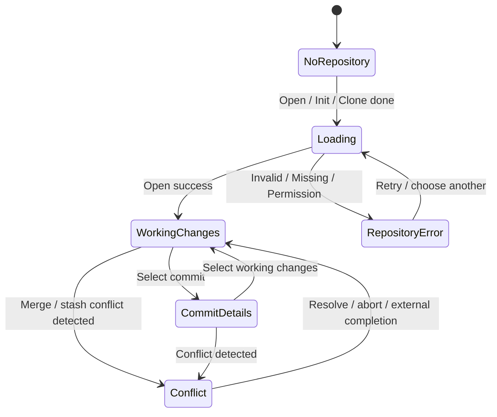

# UI/UX specification

## 1. Diễn giải ảnh tham chiếu

[Ảnh gốc](../example.webp) là sơ đồ chú thích, không phải screenshot đủ độ phân giải để lấy token chính xác. Màu, font, spacing dưới đây là đề xuất triển khai; giữ topology và density của ảnh, không sao chép logo/chữ watermark.

| Vùng trong ảnh | Component dự kiến | Chức năng |
|---|---|---|
| Open/Clone/Init; Repo/Branch Navigation | `RepositorySwitcher`, `BranchPicker` | Chọn repo, tạo/mở/clone, hiển thị HEAD |
| Toolbar | `GitToolbar` | Fetch, Pull, Push, Branch, Stash; tooltip và trạng thái busy |
| Left Panel | `RepositorySidebar` | Working changes, Local, Remote, Stashes, Tags; PR và Submodules theo PRD |
| Commit Graph | `HistoryPane` + `CommitGraph` + `CommitList` | Branch lanes, refs, subject, author, time |
| Commit Panel States | `InspectorPanel` | Working changes, Commit details, Merge conflict |
| Search/Profiles/Menu/Feedback | `HistorySearch`, `IdentityInfo`, `AppMenu`, `StatusBar` | Search, identity read-only, preferences, help |

Xem ba [wireframe](design/README.md); các commit/file trong hình là dữ liệu minh họa.

## 2. Hình học cửa sổ

**Target 1440×900 CSS px**, native titlebar giữ theo OS. Vùng app bên dưới titlebar:

- Topbar 48px; toolbar 44px; status bar 24px; content chiếm phần còn lại.
- Sidebar 220px mặc định, clamp 180–300px. Inspector 380px, clamp 320–520px. Center co giãn, min 420px.
- Hai splitter có hit area 8px và separator 1px. Double-click reset width; bàn phím Left/Right điều chỉnh khi splitter focus.
- Commit row 32px, header 32px. Graph lane 20px, dot radius 4px, stroke 2px. Metadata không lấn vùng subject.
- Window min 1100×700. Tại 1280×800 giữ ba panel; bảng history cuộn ngang khi tổng độ rộng cột vượt center, không tự ẩn Author. Phóng to font ưu tiên nội dung chính, không thu font dưới setting.

History có thứ tự **Branch → Graph → Subject → Author**. Branch label nằm tại commit đầu nhánh, phân biệt `local` và tên remote thực tế như `origin`; nhiều refs cùng commit hiển thị tối đa hai dòng và số lượng còn lại kèm tooltip. Không suy đoán tên branch cho toàn bộ ancestry. Author có short OID; tooltip chứa author, thời gian và full OID.

Cả bốn cột resize bằng kéo separator hoặc Left/Right (Shift để tăng bước); double-click/Home reset. Độ rộng được lưu cục bộ; Subject mặc định lấp chỗ trống, sau resize giữ độ rộng người dùng chọn. Graph resize từ 64–1600px, độc lập số lane. Nếu lanes rộng hơn cột, thanh cuộn nhỏ ngay dưới nhãn Graph dịch toàn bộ lane cùng nhau, giữ nguyên khoảng cách 20px; hỗ trợ Left/Right/Home/End và tự đưa node được chọn vào vùng nhìn thấy. Thanh cuộn ngang ở đáy main panel di chuyển cả bảng. Header sticky và rows nằm trong cùng scroll container để luôn thẳng hàng, kể cả khi focus bằng bàn phím. Hai mép sidebar/inspector kéo được để đổi chiều rộng main panel.

Center và sidebar scroll độc lập; inspector có header/action footer cố định và phần nội dung scroll. Diff có horizontal scroll khi dòng dài. Không làm toolbar cuộn ngang. Menu overflow cho action ít dùng ở chiều rộng nhỏ.

Chuột phải mở context menu theo đúng đối tượng, không thay selection chỉ để copy: repository tab có Switch/Copy path/Open another/Close; file Working changes có Open diff/Stage hoặc Unstage/Discard file changes/Copy path; file Commit details có Open diff/Copy path. Rename thêm original path.

Commit menu giữ thứ tự nhóm desktop Git: Checkout; Create branch/tag; Push; Cherry-pick/Revert; Merge/Rebase; Reword/Modify/Edit author/Split/Move/Interactive rebase; Reset soft/mixed/hard. **Create branch here…** dùng exact OID của row và mở branch modal ghi rõ commit nguồn. Open details/Show in graph khi search/Copy ID/Copy subject nằm sau nhóm Git action. Action chưa có typed backend command hiển thị `Planned`, disabled và có tooltip nêu preflight/confirmation còn thiếu; hard reset dùng danger color. Không nối action lịch sử vào command gần giống nhưng khác semantics.

Action mutation bị disabled khi repo busy/read-only. Menu fixed trong viewport, tự lật ở mép, có scroll dọc khi cao hơn cửa sổ, highlight row nguồn và đóng khi click ngoài. Context Menu key hoặc Shift+F10 mở cùng menu; Arrow Up/Down, Home/End, Enter/Space, Escape/Tab điều hướng và đóng.

### Repository tabs — mở rộng theo yêu cầu 23/09/2026

Một hàng tab nằm trên topbar. Mỗi tab có tên repo, branch, chỉ báo changed files/draft/busy/error và nút ×; active tab có viền mint. Tên trùng nhau thêm phần parent path; tooltip chứa full display path. Tab strip cuộn ngang, tự đưa active tab vào vùng nhìn; **+ Open repo** luôn ở mép phải. Open/Initialize/Close cũng có trong Menu; không lặp lại cả hàng nút ở topbar.

**+ Open repo** mở picker Recent có tìm kiếm, nhãn Open tab cho repo đã mở, Browse folders (native cho chọn nhiều folder), Initialize và empty/error/loading. Cancel hoặc open thất bại giữ các tab hiện có. Backend canonicalize và trả repoId; mở lại cùng worktree chọn tab đang có, không tạo bản sao. Repo khác hoặc linked worktree khác giữ workspace độc lập.

Chuyển tab giữ search, scope, commit selection, graph viewport và commit diff; draft subject/body riêng theo worktree. Khi active lại, đọc snapshot/status mới; worktree/index diff cũ đóng vì token listing có thể hết hạn. Operations vẫn thuộc repo đã bắt đầu, không chuyển sang tab hiện tại. Nút × bị khóa khi repo đó có operation; backend kiểm tra busy lần nữa. Đóng tab không xóa folder, không discard Git changes; draft được lưu. Tab cuối đóng về Welcome. Các tab chưa tự mở lại sau restart; draft được khôi phục khi user mở lại repo.

Phím tắt: `Ctrl/Cmd+O` mở picker; `Ctrl/Cmd+Tab` và Shift đảo chiều; `Ctrl/Cmd+W` đóng active tab và lưu draft. Trong tablist, Left/Right/Home/End chọn tab; Delete đóng tab. Modal chặn chuyển/đóng tab bằng phím tắt; inactive workspace không xử lý phím tắt foreground. Native workflow vẫn cần nghiệm thu riêng.

## 3. Tokens

Source of truth: [tokens.css](design/tokens.css). Nền canvas `#111618`, panel `#192124`, raised `#222d31`; text `#e5eeeb`, secondary `#a8bbb5`; accent mint `#66d9b2`. Lanes dùng mint, cyan, blue, violet, amber, rose, không mang nghĩa branch cố định ngoài một history snapshot.

System sans cho UI; system monospace cho OID/path/diff. Body 13px, secondary 12px, section title 12px medium, panel title 15px. Border radius 4–6px, không card dashboard, gradient hay shadow lớn. Icons stroke nhất quán, dùng một thư viện icon đã pin; label cho primary toolbar actions. Không emoji thay icon trong sản phẩm.

## 4. Ba trạng thái inspector

### Working changes

Không lặp header “Working tree”. Thanh trạng thái gọn gồm tổng số changed files (không đếm hai lần file vừa staged vừa unstaged), tên nhánh và nút **Refresh** có label. List chia **Unstaged**, **Staged**, **Conflicts**; mỗi file có status chữ `M/A/D/R/?/U`, file name chính/path phụ và action trực tiếp. Không dùng checkbox selection: Unstaged có **Discard** + `+` Stage, Staged có `−` Unstage; header nhóm có Stage/Unstage all. Không dùng file/count demo khi status chưa load; có loading/error/retry/clean/read-only state.

Chọn file mở unified diff trực tiếp trong **main panel** ở giữa, thay vùng graph; inspector bên phải giữ danh sách file để đổi file. Header diff có tên/path, nguồn so sánh và nút **× (Close diff)**; `×`/`Escape` đóng diff và khôi phục graph với vị trí cuộn/commit selection. File trong Unstaged dùng `worktree`, file trong Staged dùng `index`, kể cả cùng một path xuất hiện ở cả hai nhóm. Mỗi text hunk của worktree diff có **Stage hunk** và **Discard hunk**; untracked/binary/truncated diff giải thích vì sao partial action không khả dụng. Discard file/hunk mở modal nêu exact target và hậu quả, focus mặc định **Cancel**. Kết quả request cũ không được ghi đè lựa chọn mới hoặc mở lại panel đã đóng. Binary/large file có summary, không render dữ liệu thô. Footer chứa subject, body mở rộng và nút **Commit N files**. Không có Commit & Push ở MVP.

Khi stage/discard hunk xong refresh status và mở lại worktree diff bằng pathId mới nếu file vẫn còn unstaged; discard cả file đóng diff. `hunkId` định danh exact raw patch bytes và backend phải rebuild/verify trước mutation. Token selection thuộc snapshot status; display path chỉ dùng tìm lại row sau refresh, không được gửi ngược thay pathId vào Git command. Commit editor cố định ở dưới, có Summary, description tùy chọn, identity và lý do nút commit disabled. Commit thành công chọn node mới; draft chỉ clear sau khi xác minh HEAD kết quả. Ctrl/Cmd+Enter chỉ commit khi input message đang focus và điều kiện hợp lệ.

### Commit details

Header subject, full OID có thể chọn/copy với feedback, author, timestamp (tooltip giữ giá trị gốc có timezone), ref labels. Body message wrap như plain text. Parents có nút điều hướng; merge có dropdown **Compare to parent**. Changed files có bộ lọc theo path và empty state khi không có kết quả. File list và diff theo parent đã chọn; click file mở cùng main panel với nút ×. Đổi commit/parent hoặc chuyển inspector đóng diff cũ trước khi nạp context mới. Root commit so với empty tree do backend tính, không hardcode hash SHA-1.

Không hiện stage controls cho lịch sử. Action “Back to working changes” luôn có. Link trong commit message không tự mở; URL chỉ có explicit action sau scheme validation.

### Merge conflict

Banner **Merge in progress: feature/ui → main**; danh sách conflicted file và loại conflict. Text conflict có Base/Current/Incoming preview và working result; MVP chấp nhận current/incoming **toàn file**, hoặc người dùng sửa bằng editor riêng rồi Refresh. Không giả đã có merge editor theo từng hunk.

“Use current”/“Use incoming” hiển thị tên branch và overwrite confirmation cho file đang có edit. Add/add, modify/delete, rename/delete, binary và submodule có hành vi riêng theo Git engine; trường hợp không hỗ trợ yêu cầu external resolution. “Mark resolved” chỉ stage sau xác nhận kết quả; không tự kết luận do hết chuỗi conflict marker. Complete merge chỉ enabled khi index không còn unmerged entries. Abort có modal hậu quả; không xóa file người dùng bằng cleanup tự động.

## 5. State machine

Busy là state của operation, không thay toàn màn hình. Conflict ưu tiên trên selection; vẫn cho đọc history nhưng banner luôn hiện và mutation không liên quan bị khóa. Khi đổi repo, reset request epoch và selection theo repo mới; lưu draft theo repo, không mang draft qua repo khác.

## 6. Controls và feedback

| Tình huống | UI bắt buộc |
|---|---|
| Repo chưa được chọn | Welcome với Open / Clone / Init, recent list, Git preflight |
| Repo chưa trusted | History vẫn đọc được; Working changes có Trust repository explanation/action, counts là unavailable, không giả 0 changes |
| Repo rỗng | “No commits yet”, working changes hoạt động, không lỗi HEAD |
| Loading | Skeleton cho lần đầu; giữ dữ liệu cũ có “Refreshing…” cho refresh |
| Không có thay đổi/kết quả | Empty state có đúng hành động tiếp theo; không spinner vô hạn |
| Auth/network/locked/stale | Inline error gồm operation, error code, lý do, Retry/Refresh/credential guidance thích hợp. `AUTH_REQUIRED` phân biệt HTTPS credential helper và SSH agent; Bitbucket Cloud HTTPS hiện **Connect Bitbucket** với modal API token Read/Write; Retry luôn do user click |
| Operation đang chạy | Status bar progress; khóa nút mutation; read navigation vẫn dùng được |
| Cancel mutation | “Checking repository state…” trước trạng thái terminal; không báo đã rollback |
| P2 | Planned/Read-only có giải thích; Undo/Redo ẩn ở MVP |

Toast chỉ cho success ngắn và có log xem lại; lỗi quan trọng phải tồn tại đến khi xử lý. Không tự gửi diagnostics. Một click nhanh lặp không tạo hai jobs giống nhau.

## 7. Keyboard và accessibility

| Shortcut | Hành vi |
|---|---|
| Ctrl/Cmd+O | Open repository |
| Ctrl/Cmd+F | Focus history search |
| Ctrl/Cmd+R | Refresh snapshot |
| Arrow Up/Down; Enter | Điều hướng/chọn commit trong list có focus |
| Space | Toggle file selection trong file list, không áp dụng khi nhập text |
| Ctrl/Cmd+Enter | Commit khi message editor focus và enabled |
| Escape | Đóng modal/search/main-panel diff theo lớp; không cancel mutation ngầm |
| Context Menu / Shift+F10 | Mở context menu cho repository tab, commit hoặc file đang focus |

Semantic buttons, accessible labels cho icons, visible focus, tree/list selection rõ ràng. Tooltip không phải nơi duy nhất chứa lỗi. Graph SVG trang trí đi kèm semantic commit list có parent summary; screen reader không phải đọc mọi đoạn line. Respect reduced motion; không animation graph làm nhảy selection.

## 8. Visual acceptance

T02 dùng mock mode có nhãn **Demo data**; T05 trở đi production chỉ dùng real IPC. So sánh ba trạng thái với [wireframe](design/README.md) và ảnh gốc. Pass khi thứ tự vùng, graph prominence, density, text contrast, alignment và khả năng resize đạt rubric trong [QA](08-testing-and-acceptance.md). Wireframe không phải bằng chứng rằng Git đã chạy được.
