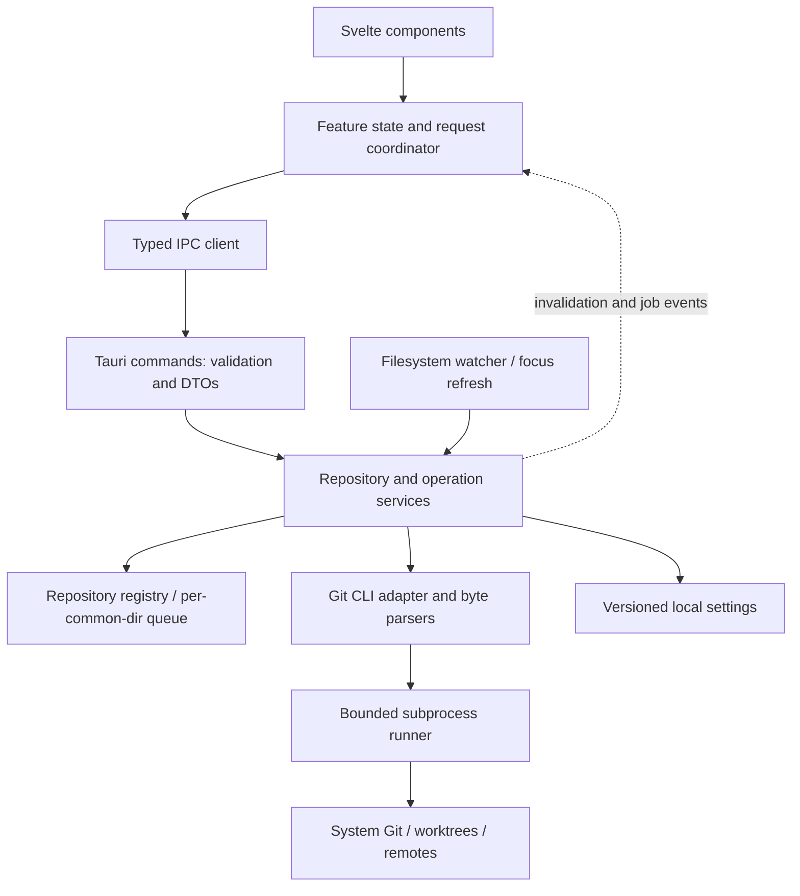

# Architecture

## Quyết định

Một desktop app, không server. Svelte quản lý presentation; Rust sở hữu Git operations và persistence. Tauri commands là ranh giới typed request/response; events dùng invalidation/progress, không coi event là nguồn dữ liệu bền vững. Tauri hỗ trợ command async và dữ liệu serialize qua IPC. [Calling Rust](https://v2.tauri.app/develop/calling-rust/)



## Stack và giới hạn

| Layer | Chọn | Lý do / giới hạn |
|---|---|---|
| Desktop | Tauri 2 | Window + native dialogs + typed Rust entry points; quyền cấu hình hẹp |
| Frontend | Svelte 5 + TS strict + Vite SPA | Không SSR/SvelteKit server; runes cho component/feature state |
| Backend | Rust stable pin tại T01, Tokio, serde, thiserror, tracing | Async subprocess/I/O; không block UI runtime |
| Git | System Git CLI | Tương thích workflow/config người dùng; adapter kiểm soát argv và output |
| Watch | `notify` hoặc tương đương pin tại T07 | Watch chỉ là tín hiệu invalidation; focus/manual refresh là fallback |
| UI tests | Vitest + Testing Library, Playwright cho mock browser; WDIO cho native | Browser mock không thay thế native Git end-to-end |
| Persistence | Versioned JSON trong app data/config directory | Chưa cần SQLite; atomic write và migration test |

Pin patch versions và lockfiles tại T01 sau khi kiểm tra compatibility. Không gọi các major trên là “latest”. Svelte 5 dùng runes như `$state`/`$derived`; giữ state domain ngoài component khi nhiều vùng dùng chung. [Svelte runes](https://svelte.dev/docs/svelte/what-are-runes)

## Cấu trúc đích sau scaffold

```text
src/
  app/                     # App.svelte, window shell, composition
  lib/
    components/            # Button, Splitter, Dialog, EmptyState
    features/
      repository/ history/ worktree/ diff/ branches/
      remotes/ stash/ conflicts/ preferences/
    ipc/                   # client.ts, generated DTOs, request helpers
    state/                 # repo session, jobs, selections
    styles/                # copied tokens + app styles
  mocks/                   # explicit browser demo/test adapter
src-tauri/
  src/
    commands/              # thin handlers by feature
    domain/                # internal IDs, errors, snapshots
    services/              # use cases + repo registry + job registry
    git/                   # runner, argv builders, status/log/diff parsers
    security/              # path, trust, confirmation, redaction
    persistence/           # settings and migrations
  capabilities/ permissions/
  tests/                   # disposable fixture repo tests
tests/
  e2e/ fixtures/ visual/
docs/                      # this specification stays in place
```

Ưu tiên feature modules; không tạo generic plugin framework, dependency injection container hay microservices. Traits `GitExecutor` và `SettingsStore` chỉ khi cần test boundary.

## Ownership và luồng dữ liệu

1. Native picker trả folder; backend canonicalize và discover worktree/common git dir. UI nhận opaque `repoId`, không tự suy đường dẫn Git.
2. Backend tạo `RepoSnapshot` gồm generation `version`. Read results gắn repoId, version, requestId; UI bỏ response của repo epoch hoặc request đã hết hiệu lực.
3. `RepoSession` sở hữu snapshot + query cache; `InspectorState` sở hữu lựa chọn; `DraftStore` sở hữu message theo repo. Không sao chép toàn bộ Git state ở ba stores.
4. Mutation gồm `expectedVersion` và `requestId` → backend queue theo canonical common git dir → revalidate state → execute → rescan → trả terminal result/event.
5. Watcher debounce 200–400ms, coalesce theo repo; đang write thì đánh dấu pending refresh. Focus refresh + manual refresh luôn sẵn. Background polling chỉ khi watcher unavailable, mặc định 5 giây khi cửa sổ active.

Read concurrency tối đa 4 jobs/repo, mutation một job/common git dir. Git external processes vẫn có thể race; dùng native lock của Git, reread và báo state drift, không xóa lock file để “sửa”. Một instance app ban đầu; nhiều worktree có registry riêng nhưng dùng chung write queue.

T17 (yêu cầu user 23/09/2026): `App.svelte` quản lý lifecycle các repository tabs và picker. Mỗi `RepositoryWorkspace.svelte` được mount riêng theo repoId, giữ local state và async callbacks riêng; tab ẩn vẫn giữ state, operations chỉ cập nhật tab sở hữu chúng. Close destroy workspace, dọn listeners/search timers/polling; foreground shortcuts/focus chỉ chạy cho active workspace. Backend registry dedup theo canonical worktree root + git dir, không theo common dir. `workspaceKey` ổn định do backend cấp dùng cho draft; write queue và trust giữ common-dir identity. Không tự khôi phục tabs hoặc replay jobs sau restart.

## Commit graph

Backend cung cấp OID/parents/topological order; frontend pure layout tính lane/edges, không dựa vào indentation hay màu parse từ `git log --graph`.

- Topology snapshot cố định tips/HEAD trong một query; pagination cursor opaque chứa session và offset. Parent của dòng trước có thể xuất hiện ở trang sau.
- Lane state carry qua page boundary; cache theo history session. Đổi scope, refs hoặc ordering làm invalid session, restart có giữ selected OID nếu còn reachable.
- Topology pass lightweight OIDs/parents có thể streaming; metadata lấy theo page. Không chạy full `--skip N` không giới hạn cho mỗi lần scroll mà chưa đo.
- Virtualized rows; graph SVG chỉ vẽ viewport + overscan, sử dụng cùng row metrics với commit list. Node/edge test dựa invariant và fixtures merge, không screenshot alone.
- Shallow boundary/missing parent hiển thị terminator. Search là list kết quả có “Show in graph”; không nối giả các dòng thiếu ancestor.

## Diff pipeline

Request rõ `worktree`, `index` hoặc `commit + parentIndex`; backend xác thực file token lấy từ listing. Default unified text, 3 context lines; parse file metadata độc lập từ raw/name-status NUL records. Không tin header `diff --git` để định danh path có quote/newline.

Threshold ban đầu: 2 MiB/file preview, 20k diff lines, 8 MiB/response; trả `truncated` và summary. Binary, gitlink và LFS pointer báo loại dữ liệu; không chạy converter. Engine không thay byte của file để hiển thị Unicode. Stage whole file ở MVP; chưa patch theo hunk.

## Error và observability

Error code typed + message người dùng + recovery action; stderr raw chỉ local diagnostic đã redact. Mọi job log operationId, repo pseudonym, duration, exit class; mặc định không path, message, nội dung diff hoặc URL credential.

Không tự retry mutation khi timeout/IPC mất kết nối. Query `operation_get` và refresh trước; requestId dedup trong session. Restart app không tự replay job đang dở. Xem [IPC contracts](04-ipc-contracts.md) và [security/data](09-security-and-data.md).
