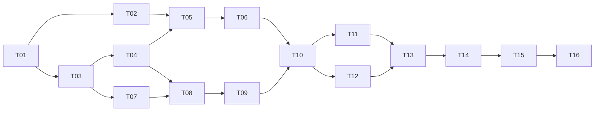

# Implementation plan

**Bắt đầu T01.** Mỗi task ước lượng 0.5–2 ngày công kỹ thuật gồm code + kiểm chứng; không phải cam kết thời gian chạy AI. Một ngày công = 8 giờ. Thời gian thực tế phụ thuộc môi trường, Git edge cases và review.

## Milestones và gates

| Mốc | Tasks | Đầu ra nhìn thấy được | Gate | Ước lượng |
|---|---|---|---|---|
| M0 Foundation | T01–T02 | Tauri window + dark shell 3 cột bằng demo adapter | Linux dev app mở; checks cơ bản pass; xem đủ 3 inspector states | 2–3 ngày |
| M1 Read-only repository | T03–T06 | Mở repo thật, xem graph/refs/history/search | Topology fixtures đúng, empty/detached không crash, UI đúng mẫu | 4–6 ngày |
| M2 Local Alpha | T07–T10 | Status/diff/stage/commit/branch thật | Daily commit E2E, exact files trong index, stale request tests | 4–6 ngày |
| M3 Linux MVP features | T11–T14 | Clone/sync/stash/merge/conflict/settings | Local bare remote E2E, conflict và operation recovery pass | 5–8 ngày |
| M4 Release candidate | T15–T16 | QA evidence + Linux .deb | Native tests, performance report, fresh-machine install smoke | 3–5 ngày |

Tổng sơ bộ **18–28 ngày công**. Sau M1 đo velocity và cập nhật range; không bỏ scope acceptance để giữ ngày dự kiến. Windows/macOS là milestone riêng sau M4, chưa tính vào range này.

## Dependency graph

Graph mô tả dependencies, không tự cấp quyền chạy nhiều agent. Mặc định làm tuần tự T01 → T16. Nếu người dùng yêu cầu song song, contract ownership phải chốt trước và chỉ một agent sửa integration files chung.

## Trình tự thực hiện một task

1. Đọc task + specs liên quan, ghi assumption và plan tối đa 5 bước.
2. Đưa task sang `in_progress` trong [progress](progress.md); không tự sửa acceptance để vừa với code.
3. Implement một vertical slice có kiểm tra sát hành vi; chỉ dùng mock ở giai đoạn UI/test cho phép.
4. Chạy checks của task; sửa lỗi liên quan; review diff và chứng minh điều gì đã hoạt động.
5. Cập nhật handoff/evidence, đánh dấu `done` khi đủ tiêu chí; chọn task ready kế tiếp.

Nếu task >2 ngày công sau khi hiểu code, tách thành `Txx.a/b` với acceptance độc lập và cập nhật dependency; không tạo task nhỏ chỉ để hoàn tất checklist. Nếu thiếu dependency hệ thống, ghi lệnh/cause trong progress và tiếp tục phần độc lập; không khai báo native gate pass bằng browser test.

## Demo tại mỗi mốc

- M0: mở ba wireframe states từ demo controls; kiểm tra resize và keyboard.
- M1: mở fixture có branches/merge/tag; click commit, đổi scope, search, page tiếp.
- M2: tạo repo tạm, sửa 3 files, stage 2, commit, switch/create branch.
- M3: hai working copies + bare remote; clone/fetch/pull/push; stash conflict; explicit merge conflict rồi complete.
- M4: cài .deb trên baseline sạch, chạy workflow local + network test remote, xuất diagnostics đã redact.

## Change control

Đổi stack, Git provider, API payload, destructive operation policy hoặc scope release phải cập nhật [ADR](12-decisions-and-risks.md) trước code phụ thuộc. Routine implementation details do agent quyết định và ghi handoff; không hỏi user cho mọi tên component hoặc dependency nhỏ.
