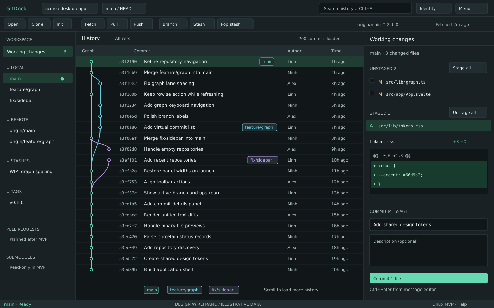
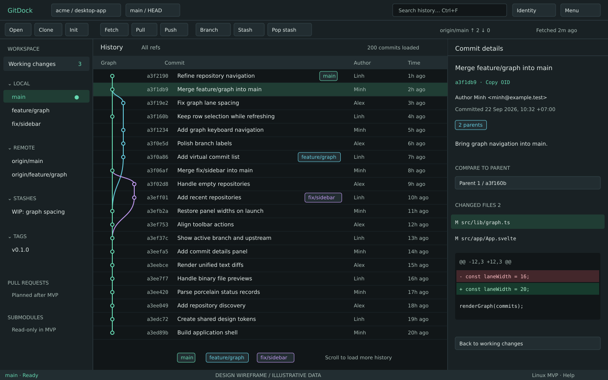
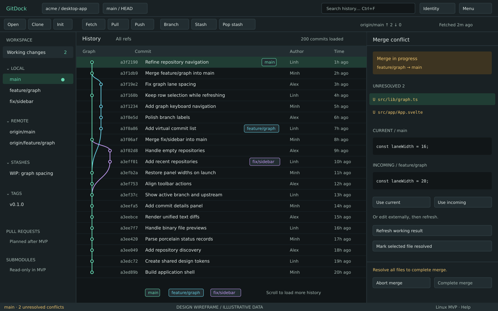

# Design reference pack

**Đối chiếu bố cục với [ảnh gốc](../../example.webp), triển khai theo [UI spec](../02-ux-ui-spec.md).** Các hình bên dưới là wireframe đề xuất, dữ liệu minh họa; chưa phải ảnh ứng dụng đang chạy.

| State | File | Nội dung cần giữ |
|---|---|---|
| Working changes | [01-working-changes.svg](01-working-changes.svg) | Staged/unstaged + diff + commit editor |
| Commit details | [02-commit-details.svg](02-commit-details.svg) | Metadata + parent selector + changed files + diff |
| Merge conflict | [03-merge-conflict.svg](03-merge-conflict.svg) | Conflict banner + files + current/incoming + resolution actions |

**Cập nhật 23/09/2026:** wireframe giữ làm tham chiếu gốc. Vị trí diff trong hình đã được thay bằng main panel có nút × theo yêu cầu mới; xem [UI spec](../02-ux-ui-spec.md).

Canvas 1440×900 CSS px, minh họa vùng app, không vẽ native window titlebar. Toolbar và graph giữ vị trí xuyên suốt ba states. Mock OIDs/names/counts phục vụ layout, không dùng như Git fixtures hay benchmark.

[tokens.css](tokens.css) là baseline CSS tokens để T02 chuyển vào `src/lib/styles`. App sử dụng bản tokens tương ứng trong `src/lib/styles/tokens.css`. Màu được đề xuất theo tinh thần ảnh; không phải sample chính xác từ pixels ảnh gốc.

Để tái tạo SVG sau khi chỉnh design: chạy `python3 docs/design/generate-wireframes.py` từ root. Script chỉ tạo lại ba SVG trong thư mục design, không chạm Git hoặc source app.
